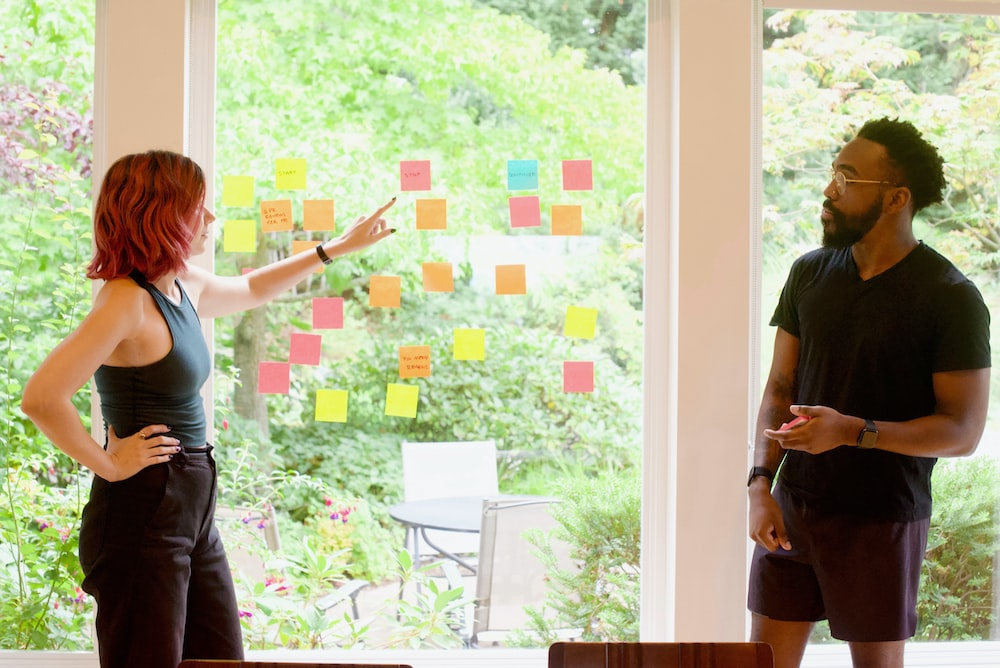
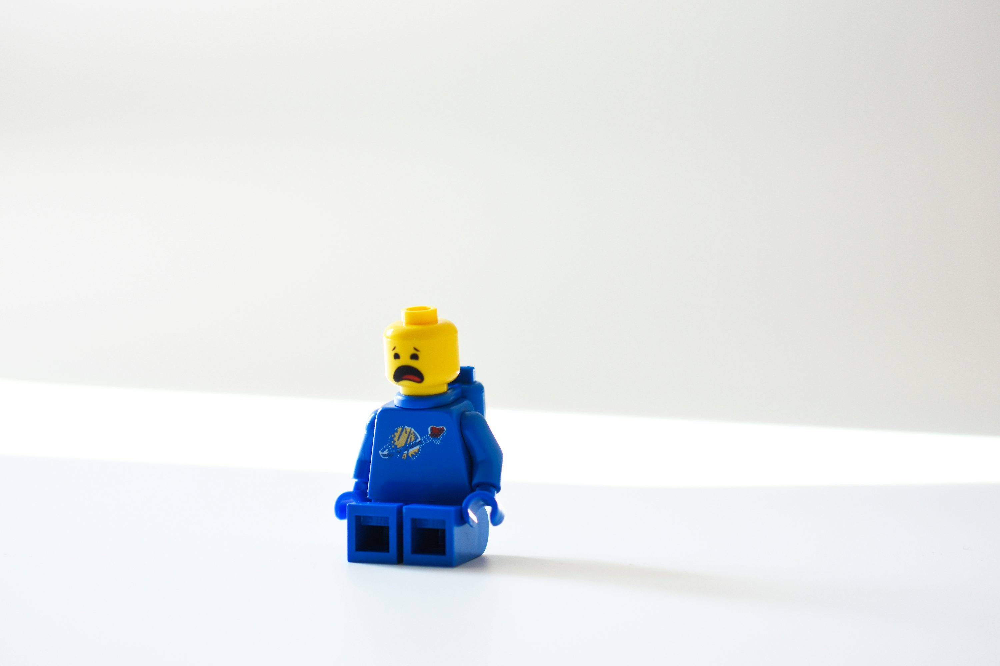

## Brainstorming Research Ideas

### PSY 360 — Lab 1

:::{.author}
Dave Brocker
:::

## How Do You Identify a Topic?

### Start With Experience

::: {layout-ncol="3"}

:::

::: {.callout-tip}
## Not acceptable sources for your paper — but great for generating ideas!
Movies, personal experience, and the news can all point you toward a question worth studying, even though none of them belong in your References section.
:::

## How Do You Identify a Topic?

### Your Topic Needs To Be...

-   Developed during the course of this semester
-   Not overlapping with other courses, projects, etc.

## How Do You Identify a Topic?

### ...And Meet Criteria for Responsible Research

## FSC IRB Guidelines

::: {.card}
No more than minimal risk to subjects
:::

::: {.card}
Benign in nature — no sensitive subjects
:::

::: {.card}
No deception
:::

::: {.card}
Anonymous — no identifiable data collected
:::

## Identifying a Topic

### Brainstorm and Consider Several Topics

{width="45%"}

::: {.callout-important}
## We want each group to have a unique idea!
:::

## Finding a Research Topic

### Know Where to Search

{width="45%"}

Begin your literature search to narrow your topic and refine your ideas.

## Finding a Research Topic

### A Worked Example

{width="40%"}

**Morbid Curiosity** → **Behavior** — how do you choose!

## Pause and Discuss

### How Do You Choose?

Starting from a broad interest (like "morbid curiosity"), what's one specific, measurable behavior you could actually study?

## Operationalization

### But What Does It All Mean?

What do you mean, "social media use changes mood"?

How they score on a mood questionnaire?

One valid operationalization — a self-report measure.

How they behave toward others in social situations?

A behavioral measure — observed interaction, not self-report.

How easily they become frustrated?

A different behavioral proxy — reaction to a frustrating task.

How their facial expressions change?

A physiological/expressive measure — could be coded from video.

How they interpret an ambiguous scene?

A cognitive/interpretive measure — often used in mood-congruent judgment studies.

## Design Methodology

### Where Does Your Idea Fit?

{width="55%"}

**Experiment** → Between or Within. **Non-Experiment** → Correlation or Regression.

## Group Experiment Planning Worksheet

Per the Fall 2026 syllabus, this is due in **Week 2 (Sep 7–11)**.

-   Submit on Brightspace
-   You can collaborate — but your group needs a unique submission!

## Key Takeaways

### Brainstorming Research Ideas

-   A good topic starts anywhere — movies, personal experience, the news — but has to hold up to IRB scrutiny: minimal risk, benign, no deception, anonymous
-   Narrow a broad interest into something specific with a literature search
-   Operationalize: turn a vague claim ("X changes mood") into a measurable behavior
-   Decide your design methodology early — Experiment vs. Non-Experiment shapes everything that follows
