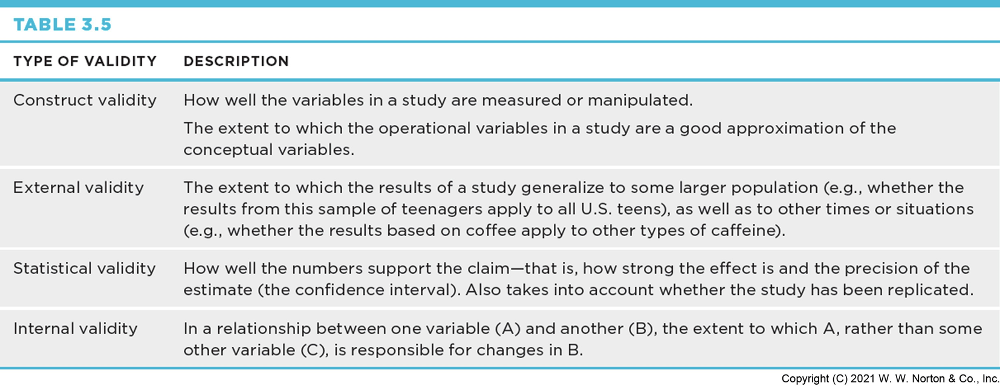
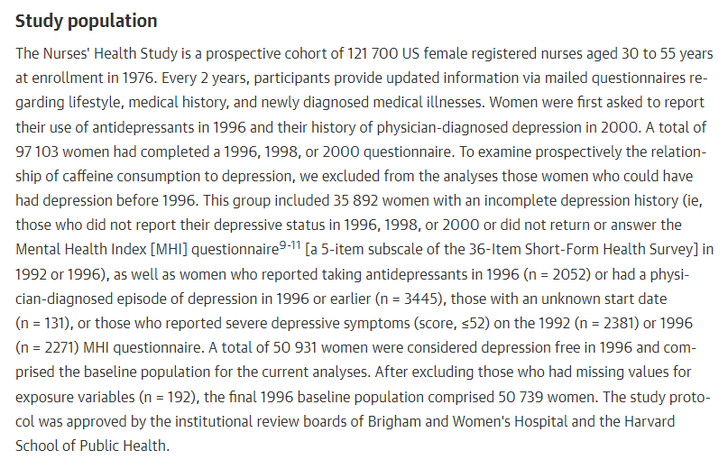
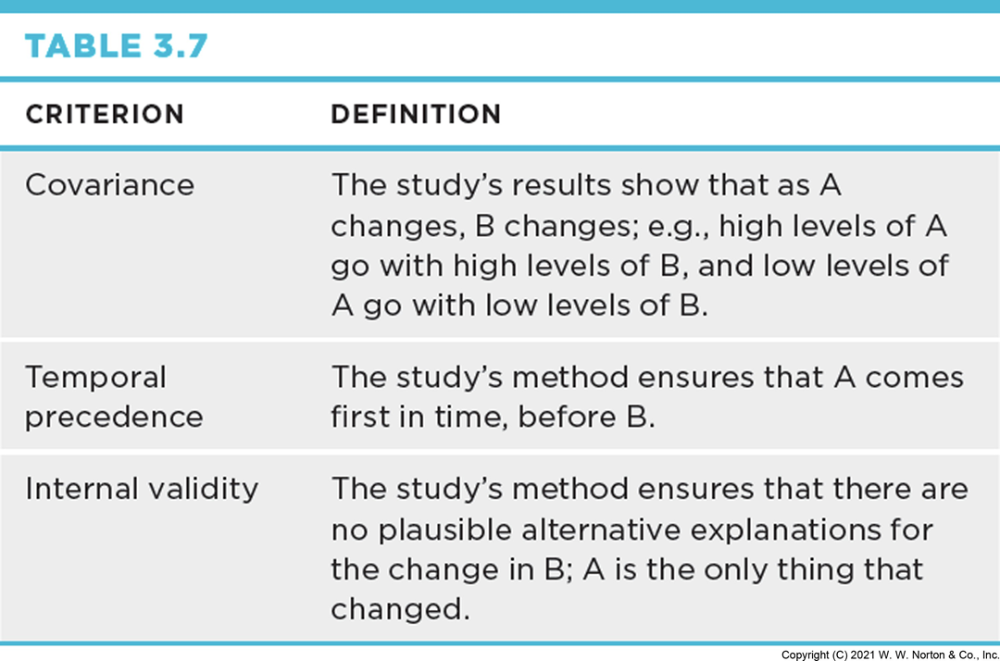
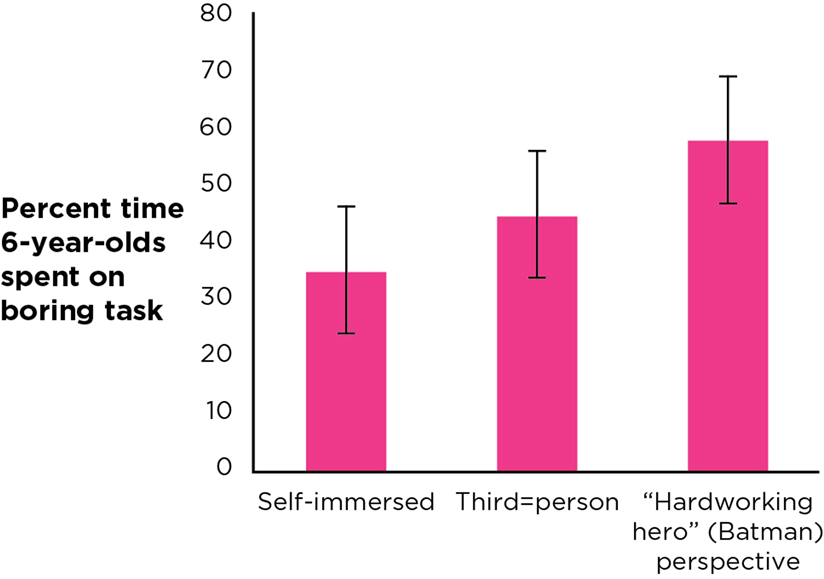

## Four Validities

### Interrogation Tools for Consumers of Research

:::{.author}
Dave Brocker
:::

::: {.callout-tip}
## Once you've identified the kind of claim, you need to be able to evaluate it.
:::

## The Four Big Validities

{width="55%"}

::: {.card}
**Construct Validity**

Does the measure or manipulation really capture the thing it claims to?
:::

::: {.card}
**External Validity**

Does the result generalize beyond this sample and setting?
:::

::: {.card}
**Statistical Validity**

How precise and reliable is the statistical estimate?
:::

::: {.card}
**Internal Validity**

For causal claims — have other explanations been ruled out?
:::

## Interrogating Frequency Claims

### "74% of the world smiled yesterday."

## Construct Validity

Does "smiled yesterday" actually capture happiness — or just a momentary facial expression, possibly to a stranger with a clipboard?

## External Validity

Does the sample who answered this survey represent "the world," or just the people who happened to be reachable?

## Statistical Validity

### Point Estimate, Confidence Interval, Margin of Error

A **point estimate** (like "74%") is a single best guess. A **confidence interval** gives the plausible range around it.

## Confidence Interval: Example

**39%** point estimate, 95% CI: **37.0% – 41.4%**

::: {.callout-tip}
## Margin of error
Half the width of the confidence interval — a smaller margin means a more precise (more statistically valid) estimate.
:::

## Interrogating Association Claims

### Coffee Consumption ↔ Depression

## Construct Validity

### Two Constructs, Two Checks

For an association claim, you check construct validity **twice** — once for each variable.

::: {.card}
**Coffee Consumption**

Self-reported cups per day? A tracked purchase log? Each captures something slightly different.
:::

::: {.card}
**Depression**

{width="35%"}

A validated clinical scale? A single self-rating question? The construct validity of *this* measure shapes how much the association claim is worth.
:::

## External Validity

Does this coffee/depression relationship hold for people outside the sample it was studied in — different ages, cultures, caffeine tolerances?

## Statistical Validity

Same tools as before — how precise is the estimate of *how strongly* these two variables are associated?

## Interrogating Causal Claims

### The Hardest Bar to Clear

## Covariance

**A** and **B** have to actually move together — if they don't covary, there's no relationship to explain causally in the first place.

## Temporal Precedence

**A** has to come *before* **B** — not the other way around, and not at the same time in a way that makes order unclear.

## Internal Validity

{width="40%"}

Rule out **C** — some third variable that could explain the A–B relationship without A actually causing B.

## Experiments Can Support Causal Claims

Because a well-designed experiment can establish all three: the researcher creates covariance (by manipulating the IV), controls temporal precedence (IV comes first, DV is measured after), and rules out confounds (random assignment spreads other differences evenly across groups).

## Independent and Dependent Variables

{width="45%"}

The **independent variable (IV)** is what the researcher manipulates (e.g., type of lessons). The **dependent variable (DV)** is what gets measured as a result.

## Random Assignment

Assigning participants to conditions by chance — the mechanism that makes "rule out other explanations" actually work, by spreading pre-existing differences evenly across groups.

## When Causal Claims Are a Mistake

### Does Social Media Pressure Cause Teen Anxiety?

{width="45%"}

A real headline claim — but does it actually meet the three criteria?

## Does It Meet the Three Criteria?

::: {.card}
**Covariance?**

Plausible — more social media use tends to co-occur with more anxiety.
:::

::: {.card}
**Temporal Precedence?**

Harder to establish — does the pressure to respond to texts and posts come *before* the anxiety, or does anxiety drive more checking?
:::

::: {.card}
**Internal Validity?**

Third variables (sleep, existing mental health, family circumstances) haven't been ruled out in most of these studies.
:::

::: {.callout-important}
## Covariance alone is not enough
This is exactly the pattern that turns a real association into an overreaching causal headline.
:::

## Other Validities to Interrogate in Causal Claims

Even once covariance, temporal precedence, and internal validity are addressed, the same **Construct**, **External**, and **Statistical** validity questions from frequency and association claims still apply — a causal claim can fail on any of the four.

## Prioritizing Validities

{width="50%"}

Not every validity matters equally for every claim. For a causal claim, internal validity usually matters most. For a claim about how common something is, statistical and external validity carry more weight.

## Key Takeaways

### Four Validities

-   Every claim — frequency, association, or causal — can be interrogated with the same four validities: Construct, External, Statistical, Internal
-   Construct validity asks whether you're really measuring what you think you're measuring
-   Causal claims carry a stricter bar: covariance, temporal precedence, *and* ruling out third variables
-   Well-designed experiments (manipulated IV, random assignment) are what let you clear that bar
