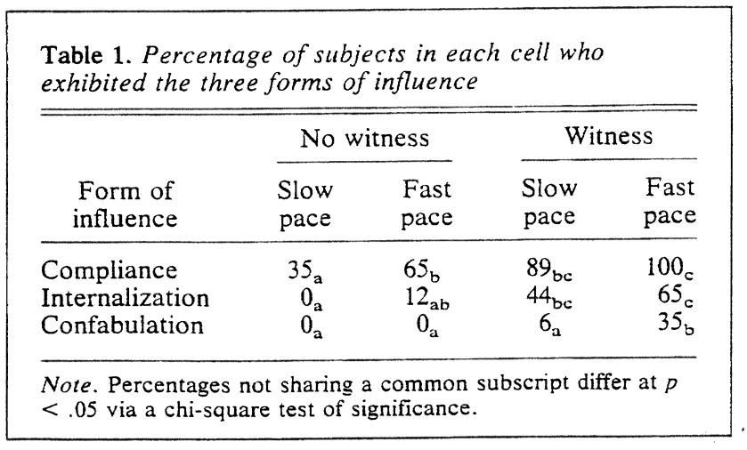
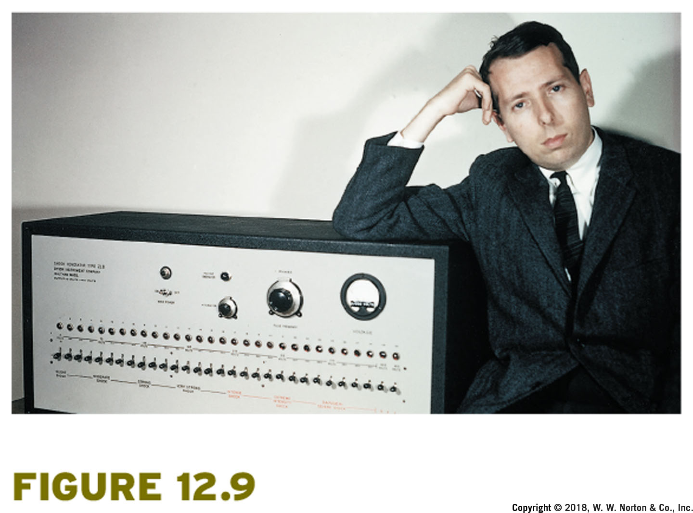
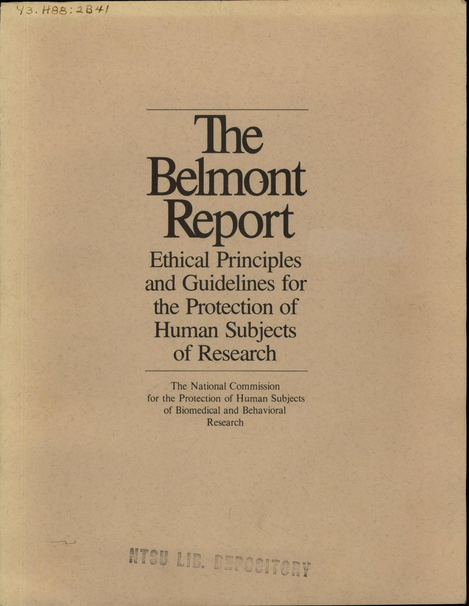
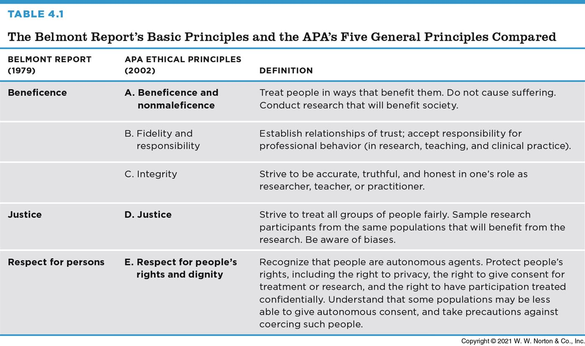
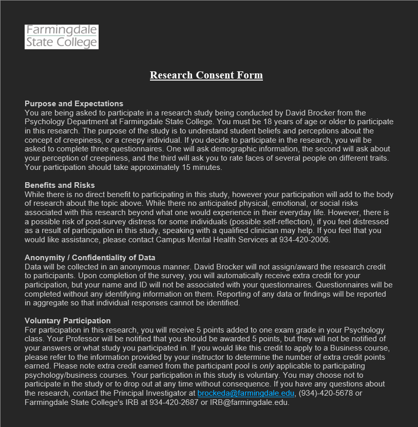
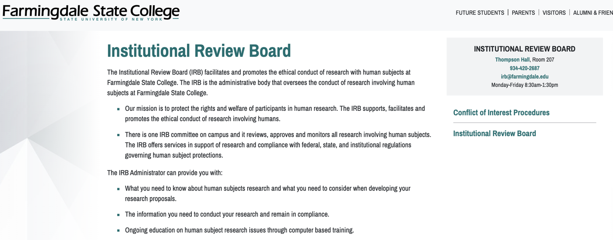
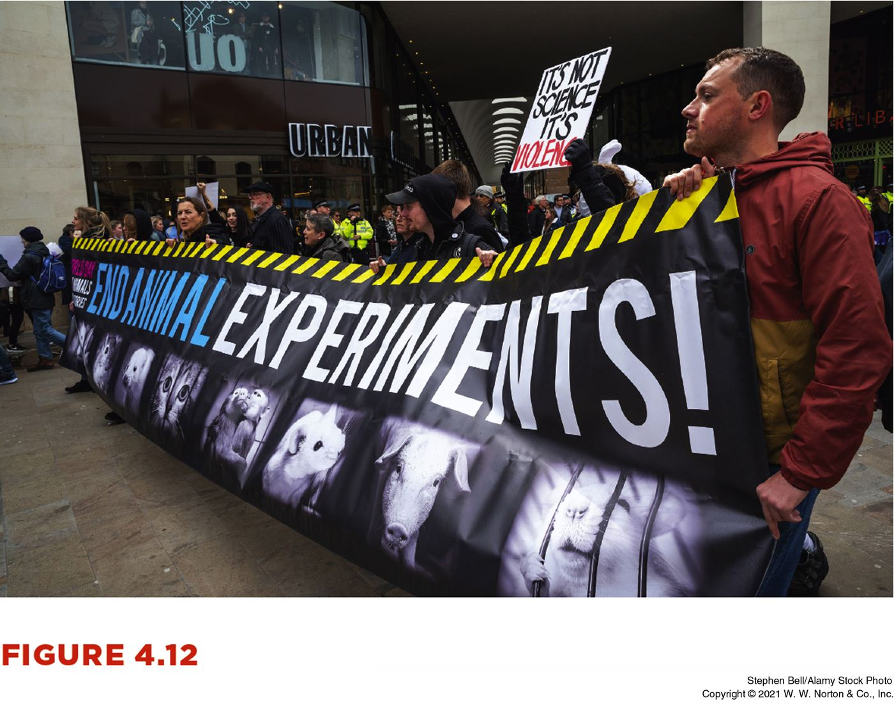
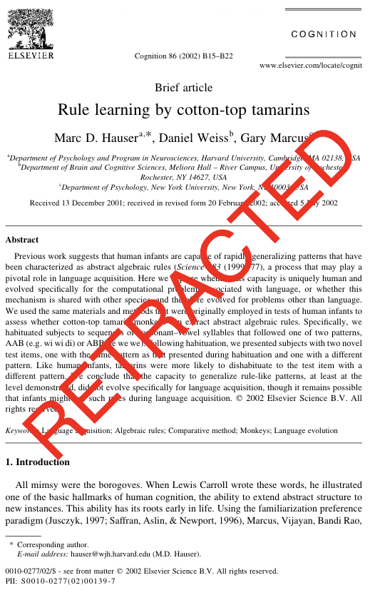
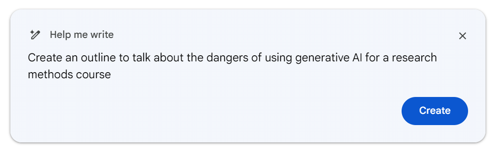

## Ethical Guidelines

### for Research Psychology

:::{.author}
Dave Brocker
:::

::: {.callout-tip}
## The opening question
Should psychologists use deception or attempt to produce certain feelings in their research participants?
:::

## Example: Kassin et al. (1996)

{width="55%"}

A study on false confessions — participants were accused of a crash they didn't cause (pressing the ALT key) after their computer "crashed."

## Experimental Design

::: {.card}
**Participants**

79 undergraduates — 40 male, 39 female
:::

::: {.card}
**IV 1: Vulnerability**

High vs. Low Vulnerability
:::

::: {.card}
**IV 2: Witness**

Witness vs. No Witness
:::

## The Method

Participants were told not to press the ALT key. 60 seconds later, the computer crashed — and a confederate suggested the participant had caused it by pressing the forbidden key.

::: {.callout-important}
## The ethical tension
No participant actually caused the crash. The study measured whether people would falsely confess — which meant deceiving every participant about what really happened.
:::

## What Is Research Ethics?

Guided by the American Psychological Association's ethical principles for research.

## Historical Highlights

### Treatment of Human Participants in Research

The modern rules governing research ethics didn't come from nowhere — they came from real cases where researchers caused real harm.

## The Nuremberg Trials

{width="50%"}

The prosecution of Nazi physicians for experiments conducted on concentration camp prisoners without consent led to the **Nuremberg Code** (1947) — the first major international standard for research ethics.

## The Tuskegee Study (1932–1972)

{width="50%"}

Researchers withheld treatment from Black men with syphilis for **40 years** — even after penicillin became a known, effective cure — without informing participants of their diagnosis or the existence of treatment.

## Milgram (1963): Obedience to Authority

{width="45%"}

Participants were instructed to administer what they believed were increasingly severe electric shocks to another person, testing how far people would go under the instruction of an authority figure.

## Zimbardo & Haney (1971): The Stanford Prison Experiment

{width="45%"}

Participants randomly assigned to "guard" and "prisoner" roles in a simulated prison — ended early after guards began behaving abusively toward prisoners.

## A Modern Example: Abu Ghraib

{width="50%"}

The dynamics observed in the Stanford Prison Experiment have been cited as a lens for understanding real abuses of institutional power decades later.

## From History to Policy

{width="60%"}

::: {.card}
**U.S. Surgeon General (late 1960s)**

First federal guidelines requiring informed consent for federally funded research
:::

::: {.card}
**National Research Act (1974)**

Established Institutional Review Boards (IRBs) in law
:::

::: {.card}
**Belmont Report (1979)**

The ethical framework still used today
:::

## The Belmont Report (1979)

{width="50%"}

Three core principles for ethical research with human subjects:

::: {.card}
**Respect for Persons**

Treat people as autonomous agents; extra protections for those with diminished autonomy
:::

::: {.card}
**Beneficence**

Maximize possible benefits, minimize possible harms
:::

::: {.card}
**Justice**

Fairness in who bears the burdens and who receives the benefits of research
:::

## APA Ethics Code

Updated and expanded many times, periodically reviewed. Ten standards total — **Section 8: Research and Publication** is the one most relevant to conducting a study.

## Major Ethical Issues

::: {.card}
**Clinical Equipoise**

Subjects must be protected from physical or psychological harm.
:::

::: {.card}
**Informed Consent**

Participants must understand what they're agreeing to before they agree to it.
:::

::: {.card}
**Deception**

When is it justified, and what has to happen afterward?
:::

::: {.card}
**Confidentiality**

Protecting what participants share.
:::

## Selected Components of an Informed Consent Form

{width="60%"}

A real consent form typically covers: the purpose of the study, what participation involves, risks and benefits, confidentiality protections, and the right to withdraw at any time without penalty.

## Deception

::: {.card}
**Everyday example**

"Everything works great on this car!" (Lie — don't mention what doesn't work)
:::

::: {.card}
**Everyday example**

"I can totally speak 3 different languages!" (Lie — applies for a bilingual position)
:::

Research deception works the same way: withholding or misrepresenting the true purpose of a study from participants.

## Deception: Guidelines

<!--
TODO (Dave): source deck slide 50 ("DeceptionGuidelines") is a diagram/animation
that didn't extract as text. Fill in your own summary of when deception is
permissible under APA guidelines (no reasonable alternative, no expected
serious harm, debriefing required) if you want the specific criteria on this
slide.
-->

Deception is only permissible when there's no reasonable non-deceptive alternative, no expectation of serious harm, and participants are **debriefed** afterward.

## Confidentiality

Protecting participants' data and identities — from the raw data itself through to how results are reported and published.

## The Institutional Review Board (IRB)

{width="50%"}

Every institution conducting research with human subjects has an IRB that reviews proposed studies **before** they begin, weighing the risks to participants against the study's scientific value.

## Is It Ethical to Use Animals in Behavioral Research?

Why do researchers use nonhuman subjects at all? Some questions can't ethically (or practically) be studied in humans — but that doesn't remove the ethical obligations toward the animals involved.

## Protections for Animal Subjects

{width="50%"}

Institutional Animal Care and Use Committees (IACUCs) play a role analogous to an IRB — reviewing study design, housing, and treatment of animal subjects.

## Ethical Decision Making

{width="55%"}

### A Thoughtful Balance

Ethical research design is rarely a simple checklist — it's weighing scientific value against risk to participants, case by case.

## Ethical Issues and Scientific Integrity

Ethics doesn't stop once data collection ends — how a study is reported and published raises its own set of ethical questions.

## "Fraud" in Science

Fabricating or falsifying data, or misrepresenting results, undermines the entire scientific record other researchers build on.

## Safeguards to Prevent Fraud

Peer review, replication, data-sharing requirements, and institutional research integrity offices all exist to catch and deter fraud — though none of them is foolproof.

## Plagiarism

::: {.callout-important}
## Repeating text verbatim is plagiarism — even with a citation
:::

**Original text**, Quirin, Kazen, & Kuhl (2009):

> Are affective experiences like happiness, sadness, or helplessness always amenable to self-report? Whereas many individuals may be able to describe their affective states or traits relatively accurately, others may provide self reports that deviate from their automatic affective reactions.

## Plagiarism: Still a Problem

**Changing a few words** is still plagiarism, even with a citation:

> Are people really in touch with their emotional responses? For example, are feelings like happiness, sadness, or helplessness always available for self-report? Whereas many individuals may be able to describe their feelings relatively accurately, others may provide self reports that deviate from their true reactions (Quirin, Kazen, & Kuhl, 2009).

## Plagiarism: Closer, Still a Problem

**Changing most of the wording** but keeping the same structure and order of ideas is a step toward paraphrasing — but is still plagiarism, even with a citation:

> Is it easy for people to report their feelings? Although some people may be able to give accurate reports, others fail to provide accurate descriptions of how they feel (Quirin, Kazen, & Kuhl, 2009).

::: {.callout-tip}
## The takeaway
Real paraphrasing means processing the idea and re-expressing it in your own structure and words, not swapping synonyms into someone else's sentence.
:::

## Large Language Models

::: {.callout-important}
## Use Caution!
:::

{width="45%"}

<!--
TODO (Dave): this section (source slides 82-93) maps to the real AI Use
Statement already built into welcome.qmd. Consider whether to keep a
shortened pointer here ("see the syllabus AI policy") or expand this section
with LLM-specific research-ethics content (e.g., citing AI-assisted writing,
data privacy in prompts, hallucinated citations) — several of the source
slides are screenshots that didn't extract as text.
-->

Large language models raise research-ethics questions of their own: from citing AI-assisted writing honestly to the risk of an LLM inventing a citation that doesn't exist.

## Key Takeaways

### Ethical Guidelines for Research

-   Modern research ethics rules exist because of real historical harm — Nuremberg, Tuskegee, Milgram, and Stanford Prison all shaped today's standards
-   The Belmont Report's three principles — Respect for Persons, Beneficence, Justice — still anchor the APA Ethics Code and IRB review
-   Informed consent, limits on deception, and confidentiality protect participants; IRBs and IACUCs review studies before they start
-   Ethics doesn't end at data collection — fraud and plagiarism (even "just changing some words") are ethical violations too
