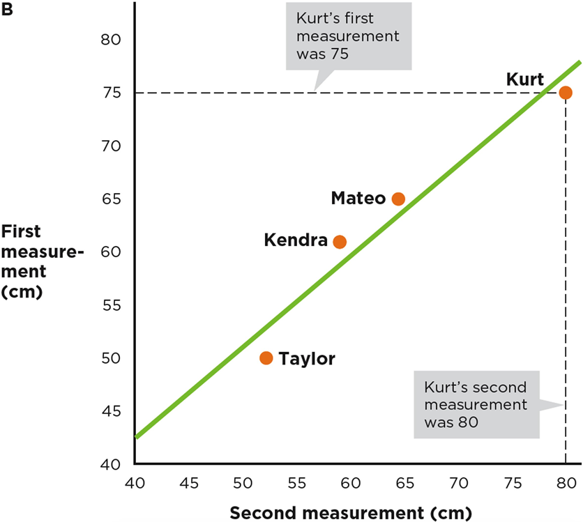
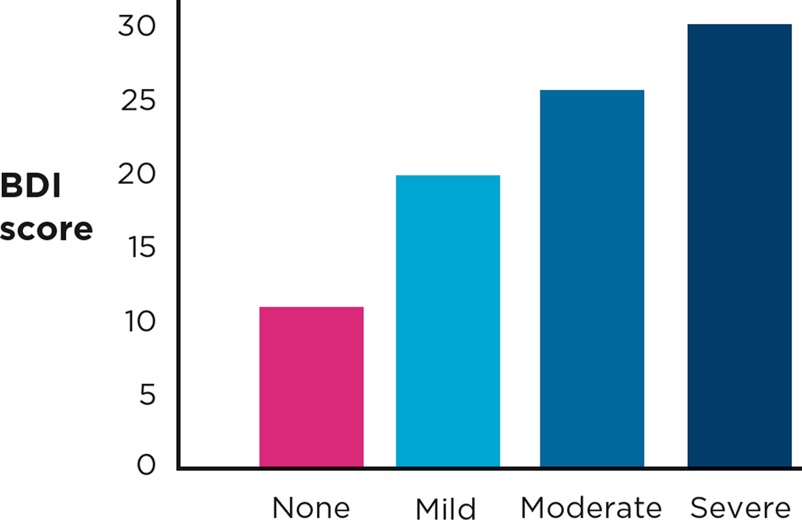
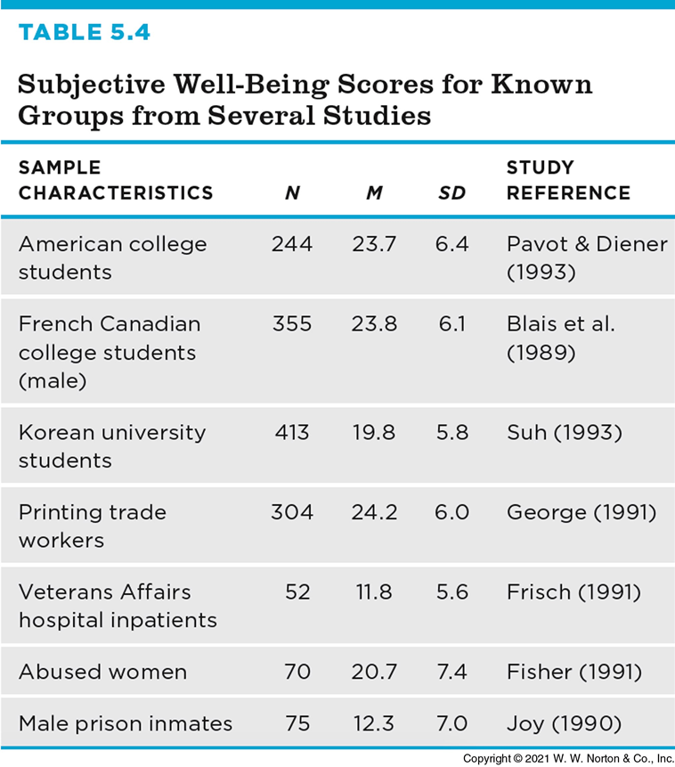
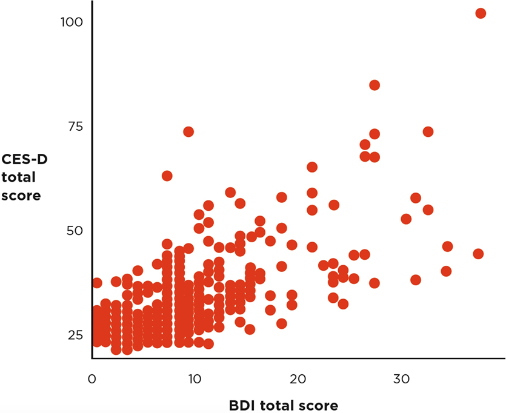
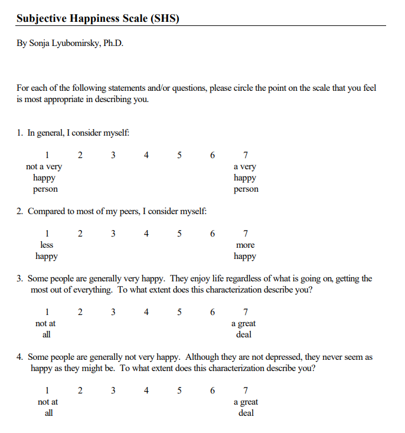

## Identifying Good Measurement

### Validity

:::{.author}
Dave Brocker
:::

::: {.callout-tip}
## The core question
Once you've operationalized a variable, how do you know your measure actually captures what you intended it to?
:::

## Operationalizing Disgust

How could you measure — operationalize — **disgust**?

::: {.callout-important}
## There's no single right answer
A facial-expression code, a self-report scale, a physiological measure (skin conductance) — each operationalization captures disgust a little differently, and each has to be validated on its own.
:::

## Operationalizing Depression

How could you measure — operationalize — **depression**?

Same challenge: a clinical interview, a self-report inventory (like the BDI), or a diagnostic code from a medical record are all different operationalizations of the same abstract construct.

## Subjective Ways to Assess Validity

::: {.card}
**Face Validity**

It looks like what you want to measure
:::

::: {.card}
**Content Validity**

The measure contains all the parts that your theory says it should contain
:::

## Empirical Ways to Assess Validity

::: {.card}
**Criterion Validity**

Your measure is correlated with a relevant behavioral outcome
:::

::: {.card}
**Convergent Validity**

Your self-report measure is more strongly associated with self-report measures of similar constructs
:::

::: {.card}
**Discriminant Validity**

Your self-report measure is less strongly associated with self-report measures of dissimilar constructs
:::

## Empirical Ways to Assess Reliability

::: {.card}
**Test-Retest**

People get consistent scores every time they take the test
:::

::: {.card}
**Internal Reliability**

People give consistent responses on every item of a questionnaire
:::

::: {.card}
**Interrater Reliability**

Two coders' ratings of a set of targets are consistent with each other
:::

## Measurement Validity of Abstract Constructs

{width="55%"}

Abstract constructs (happiness, disgust, depression) can't be measured directly — every validity check below is about how confident you can be that an indirect measure is actually tracking the construct.

## Does It Correlate with Key Behaviors?

{width="55%"}

## Criterion Validity

Does your measure correlate with a relevant, real-world behavioral outcome?

## Known-Groups Evidence for Criterion Validity

{width="50%"}

One way to test criterion validity: does the measure distinguish between groups who are *already known* to differ on the construct?

## Known-Groups: A Real Example

Psychiatrists' independent categorizations of patients are compared against scores on the measure being validated — if the groups a psychiatrist would identify score differently, that's evidence the measure is tracking something real.

## Known-Groups Evidence for Criterion Validity

{width="55%"}

Which groups have the highest and lowest subjective well-being (SWB) scores? If the pattern matches what theory predicts, that's supporting evidence for criterion validity.

## Convergent Validity

{width="55%"}

**r = .68** between the CES-D (Center for Epidemiologic Studies Depression Scale) and the BDI (Beck Depression Inventory) — two different measures of the *same* construct (depression), strongly correlated.

## Discriminant (Divergent) Validity

{width="55%"}

**r = .16** between the BDI (a depression measure) and a Physical Health Measure — a *different* construct, weakly correlated, as it should be.

::: {.callout-tip}
## Why both matter
Convergent validity shows your measure relates strongly to things it *should* relate to. Discriminant validity shows it doesn't relate too strongly to things it *shouldn't* — together they're stronger evidence than either alone.
:::

## The Relationship Between Reliability and Validity

{width="55%"}

::: {.card}
**Reliable, Not Valid**

Consistent, but consistently off-target
:::

::: {.card}
**Valid, Not Reliable**

On-target on average, but scattered
:::

::: {.card}
**Neither Reliable Nor Valid**

Scattered and off-target
:::

::: {.card}
**Both Reliable and Valid**

Consistent and on-target
:::

::: {.callout-important}
## Reliability is a prerequisite for validity
A measure has to give consistent results before it's even possible to ask whether it's measuring the right thing. Reliable does not guarantee valid — but unreliable guarantees *not* valid.
:::

## Reliability Exercise

{width="45%"}

<!--
TODO (Dave): source deck slide 31 is a hands-on "Reliability Exercise" —
likely an in-class activity or worksheet rather than lecture content. Add
the actual exercise/instructions here, or move this into a lab activity
instead of the lecture deck.
-->

## Key Takeaways

### Identifying Good Measurement: Validity

-   Subjective checks (face, content validity) and empirical checks (criterion, convergent, discriminant) both matter — but empirical checks carry more weight
-   Known-groups evidence and criterion validity ask whether a measure behaves the way theory predicts it should
-   Convergent validity (strong correlation with similar measures) and discriminant validity (weak correlation with dissimilar measures) work together
-   Reliability is necessary but not sufficient for validity — a measure must be consistent *before* it can be evaluated as accurate
