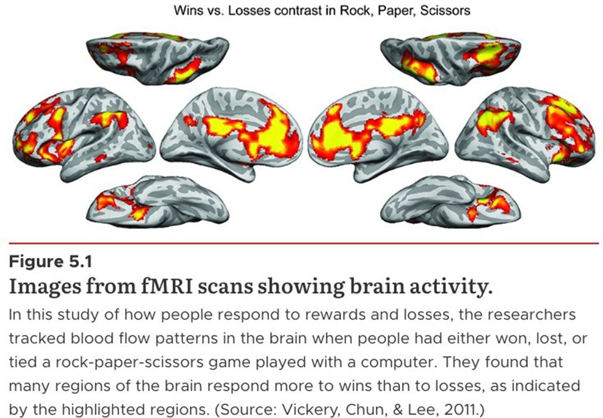
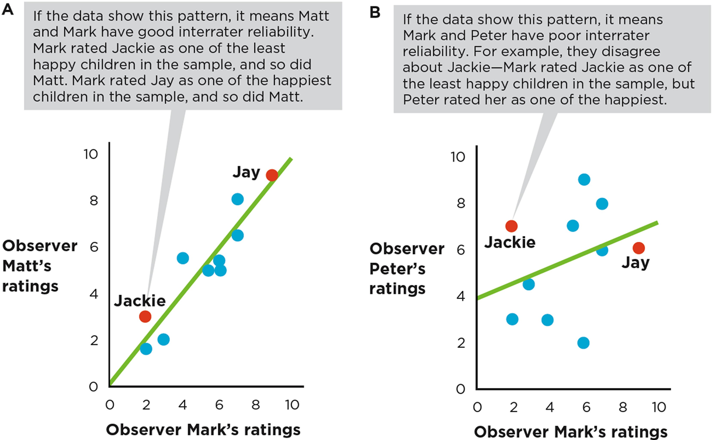
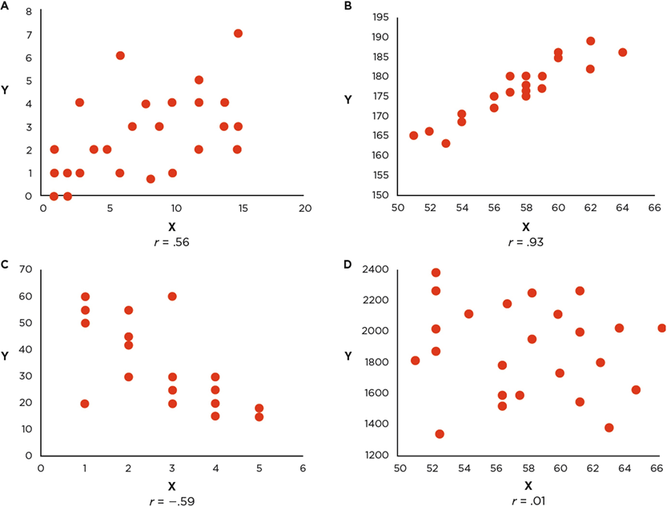

## Identifying Good Measurement

### Reliability

::: author
Dave Brocker
:::

## Ways to Measure Variables

{width="55%"}

Any variable can be expressed in two ways: a **conceptual definition** (the abstract idea) and an **operational definition** (exactly how it's measured).

## How Can We Operationalize "Happiness"?

{width="55%"}

::: card
**Conceptual Definition of "Happiness"**

A subjective sense of well-being and life satisfaction
:::

::: card
**Operational Definition of "Happiness"**

e.g., a 7-point self-report scale, or the frequency of smiling observed over an hour
:::

## Operationalizing Other Conceptual Variables

Every abstract construct in a study — stress, motivation, aggression — needs an operational definition before it can actually be measured.

## Three Common Types of Measures

{width="55%"}

::: card
**Self-Report**

Asking people to describe themselves
:::

::: card
**Observation**

Watching and coding behavior
:::

::: card
**Physiological**

Recording a bodily response
:::

## Self-Report Measures: Caffeine Consumption

{width="55%"}

e.g., asking someone how many cups of coffee they drink per day.

## Observational (Behavioral) Measures

{width="55%"}

How could you operationalize **allergies**, or **cleanliness**, by observing behavior rather than asking?

## Physiological Measures

{width="55%"}

```{=html}
<!--
NOTE: source slide references the "Brainstorm/Green Needle" auditory
illusion (like the "Yanny/Laurel" effect) — likely used as a fun, memorable
example of individual variation in perception during a physiological
measures discussion. Kept as a light aside rather than the main point.
-->
```

## Scales of Measurement

::: card
**Categorical Variables**

Groups with no inherent order
:::

::: card
**Quantitative Variables**

Values that can be ordered or measured on a continuum
:::

## Categorical Variables (Nominal)

{width="45%"}

Species — Rhesus Monkey, Bonobo, Chimpanzee — is a nominal variable: categories with no meaningful order or distance between them.

## Types of Quantitative Variables

::: card
**Ordinal Scale**

Ranked order, but unequal spacing
:::

::: card
**Interval Scale**

Equal spacing, but no true zero
:::

::: card
**Ratio Scale**

Equal spacing *and* a true zero
:::

## Ordinal Scale: Ranked Order

{width="55%"}

Coffee sizes — Short (8 fl oz), Tall, Grande, Venti — are ranked in order, but the size *difference* between each step isn't consistent from one chain to the next.

## Interval Scale

{width="55%"}

Equal intervals between points, but **0 doesn't mean "nothing."** (Think of a temperature scale — 0°F isn't the absence of temperature.)

## Ratio Scale

{width="55%"}

Equal intervals **and** a true zero that means "none of the thing exists" — which makes ratio statements meaningful (twice as much, half as much).

## Selecting a Scale of Measurement

::: card
**Nominal**

Categories only — no order
:::

::: card
**Ordinal**

Ranked, unequal spacing
:::

::: card
**Interval**

Equal spacing, no true zero
:::

::: card
**Ratio**

Equal spacing, true zero
:::

## Reliability

::: card
**Test-Retest Reliability**

Consistency across time
:::

::: card
**Interrater Reliability**

Consistency across raters
:::

::: card
**Internal Reliability**

Consistency across items
:::

## Test-Retest Reliability

{width="50%"}

Do people get consistent scores if the same measure is given at Time 1, Time 2, and Time 3?

## Interrater Reliability

{width="50%"}

Do two independent raters, coding the **same event**, arrive at consistent ratings?

## Internal Reliability (Internal Consistency)

Do people give consistent responses across every item on the same questionnaire — i.e., do the items "hang together"?

## Evaluating Reliability with a Scatterplot

{width="50%"}

Higher interrater reliability shows up as dots clustered close to the diagonal line; lower reliability shows up as dots spread further from it.

## Using the Correlation Coefficient *r*

{width="55%"}

Although a scatterplot is a good first step, the more common and efficient way to evaluate reliability is the **correlation coefficient**, ranging from **-1** to **+1**.

::: callout-tip
## Strength

The tighter the spread of dots in a scatterplot, the stronger the correlation — and the higher the reliability.
:::

## Test-Retest Reliability: Reading the Number

::: card
**Good Test-Retest Reliability**

*r* is strong and positive — .5 or above
:::

::: card
**Low Test-Retest Reliability**

*r* is positive but weak
:::

## Interrater Reliability: Reading the Number

::: card
**Good Interrater Reliability**

*r* is positive and strong — .7 or higher
:::

::: card
**Terrible Interrater Reliability**

*r* is negative
:::

## Internal Reliability: Average Inter-Item Correlation

Internal reliability is typically evaluated with the **average inter-item correlation** — how consistently each item on a scale correlates with every other item.

## Reading About Reliability in Journal Articles

```{=html}
<!--
TODO (Dave): source deck's closing slides (77-78) walk through how
reliability statistics are reported in a published Methods section. Add a
real journal-article excerpt here if you want students to practice reading
one, or point them to a sample article.
-->
```

When a published study reports "Cronbach's α = .85" or "test-retest *r* = .72," that's the same logic covered here — just applied and reported in a real paper.

## Key Takeaways

### Identifying Good Measurement: Reliability

- Every variable needs both a conceptual definition (the idea) and an operational definition (exactly how it's measured)
- Scales of measurement — nominal, ordinal, interval, ratio — determine what kinds of comparisons are meaningful
- Three reliability types: test-retest (across time), interrater (across raters), internal (across items)
- The correlation coefficient *r* is the standard tool for evaluating reliability — closer to ±1 means a stronger, more reliable relationship