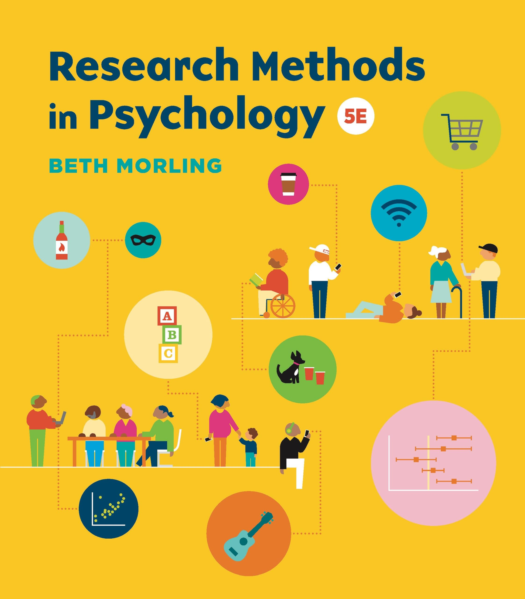
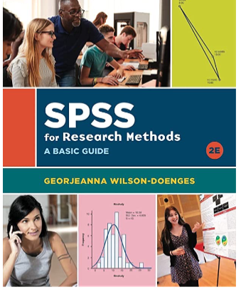

::: title-center
Research Methods
:::

::: author
Dave Brocker PSY 360 — CRN 92731 Fall 2026
:::

## Course Basics

### Lecture Tue/Thu 1:40–2:55 PM · Lab Wed 10:50–11:40 AM

Whitman Hall 253. Prerequisite: PSY 348 or permission from the Department Chairperson.

## Hi, I'm Dave!

::: side-by
{width="30%"}

My research focuses on how we view and interact with other individuals — specifically, how we classify things as **creepy**, and why we sometimes seek out negative or morbid content (**morbid curiosity**).
:::

## Email Me!

### brockeda\@farmingdale.edu

Please make sure your email has a subject line, a greeting, and your name.

::: callout-tip
## I will reply within 24–48 hours
:::

## Office Hours

### Knapp Hall, Room 15 (and virtually)

| Day      | Time                | Format                   |
|----------|---------------------|--------------------------|
| Monday   | 11:45 AM – 12:45 PM | In-person, Knapp Hall 15 |
| Tuesday  | 8:30 AM – 10:30 AM  | Virtual                  |
| Thursday | 9:00 AM – 11:00 AM  | In-person, Knapp Hall 15 |

::: callout-tip
## Office hours = time reserved for you — no appointment needed.
:::

## Who Are You?

### Pause and Discuss

Take a minute — introduce yourself to the people near you. What's your major, and what made you curious about research?

## Course Website

All materials, assignments, and grades for this course live on Brightspace.

## Required Materials

### Textbook

::: side-by
{width="25%"}

*Research Methods in Psychology*, 5th edition (2025), by Beth Morling.

ISBN: 978-1-324-08574-4

eBook: [seagull.wwnorton.com/researchpsych5](https://seagull.wwnorton.com/researchpsych5)
:::

## Recommended Materials (Optional)

::: side-by
{width="25%"}

*SPSS for Research Methods — A Basic Guide*, 2nd edition (2021), by Georjeanna Wilson-Doenges. Included with the textbook package.

ISBN: 978-0-393-88478-4
:::

## Course Structure

::: card
**Lecture**

Research methodology — exams, ethics training, extra credit
:::

::: card
**Lab**

A scientific-writing workshop: your group's original research report, one section at a time
:::

## The Lecture Component

::: card
**3 Exams**

25 pts each, 50 multiple-choice questions each. Make-up exams (essay format) are available only for well-documented medical or family emergencies — email me to confirm eligibility first.
:::

::: card
**IRB Ethics Training**

Mandatory. Complete the CITI "Advanced Social/Behavioral Research" course and upload your certificate to Brightspace before data collection.
:::

::: card
**Extra Credit (Optional)**

Participant Pool: up to 4 pts. Kahoot review games before each exam: up to 5 pts.
:::

## Grading — Lecture (85 pts)

| Activity/Assignment                        | Possible Points |
|--------------------------------------------|-----------------|
| IRB (CITI) Ethics Training and Certificate | 10              |
| Exams 1–3                                  | 75              |
| Participant Pool Extra Credit (optional)   | up to 4         |
| Kahoot Extra Credit (optional)             | up to 5         |

## The Lab Component

::: card
**Group Research Project**

In a group, you will design and run a novel psychology experiment — and present it to the class (ungraded) before data collection begins.
:::

::: card
**13 Lab Assignments**

Draft-then-final pairs building each section of an APA-style research report, one at a time.
:::

## Grading — Lab (108 pts)

| Assignment                           | Points | Assignment         | Points |
|--------------------------------------|--------|--------------------|--------|
| Group Experiment Planning Worksheet  | 3      | Method Section     | 5      |
| Two Annotated References             | 5      | Results Draft      | 3      |
| Final Topic & Annotated Bibliography | 5      | Results Section    | 5      |
| Outline Draft                        | 3      | Discussion Draft   | 3      |
| Final Outline                        | 5      | Discussion Section | 5      |
| Introduction Draft                   | 3      | Final Paper        | 55     |
| Introduction Section                 | 5      |                    |        |
| Method Draft                         | 3      |                    |        |

::: callout-tip
## Late lab work loses 1 point per day, starting at the beginning of class.
:::

## Final Grades

Your total grade is out of **193 points** (85 lecture + 108 lab), plus up to **9 points** of optional extra credit.

::: callout-important
## 85 (Lecture) + 108 (Lab) = 193 points, +9 possible extra credit
:::

## A Word on AI

### Permissible, With Attribution

You're permitted and encouraged to use AI tools like ChatGPT on assignments — with proper attribution, and full responsibility for your submission's accuracy and quality.

## A Word on AI

### Best Practices

- Thoroughly review AI output for relevance, depth, inaccuracies, bias, plagiarism, and copyright issues
- Never input another person's likeness, voice, or private information into an AI tool
- Never upload copyright-protected or paywalled content
- Cite AI as a reference whenever its output is used, quoted, or paraphrased

## How to Do Well in This Class

### Pause and Discuss

What's worked for you in past classes that you'll bring into this one?

## Any Questions?

### I Am an Open Book!